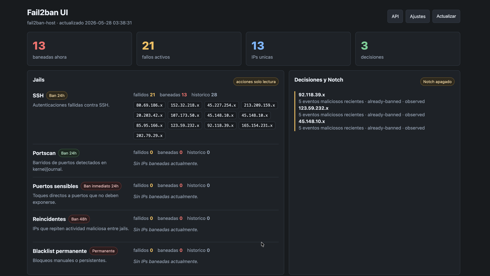
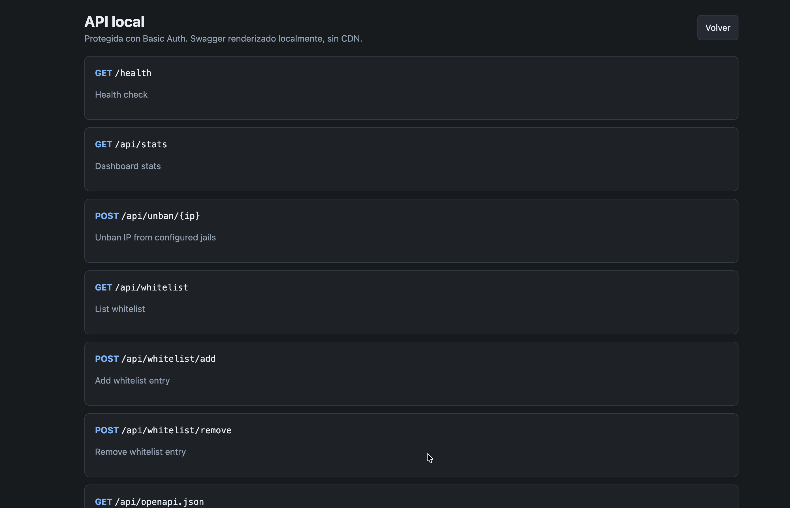
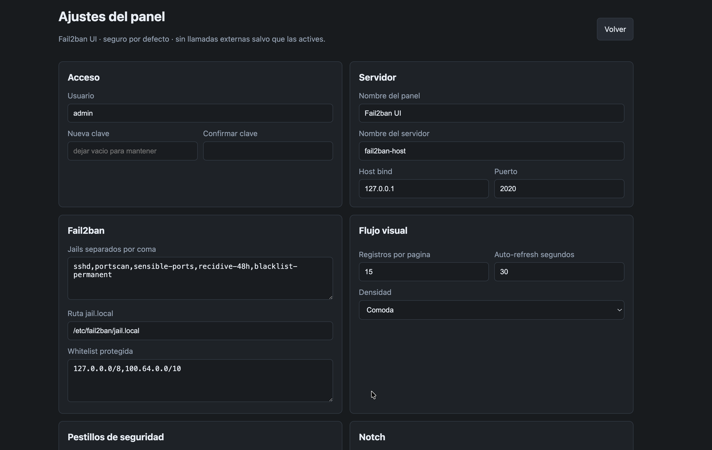
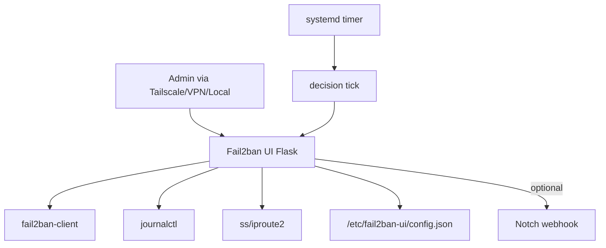
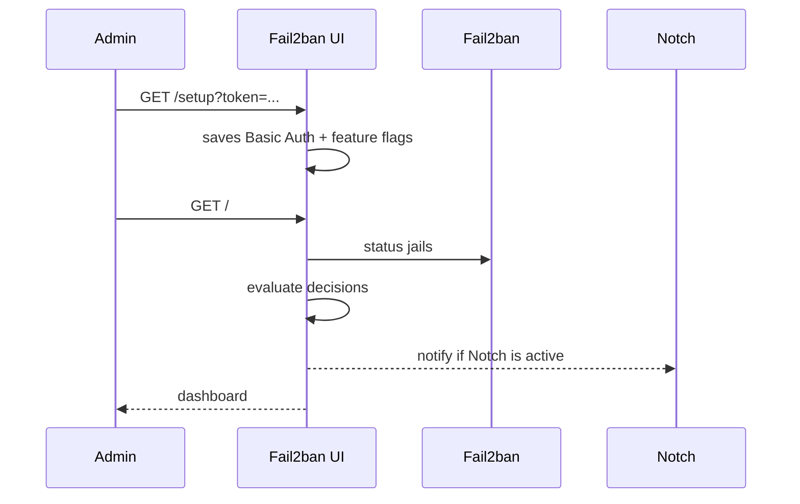

# Fail2ban UI — NGX

[](#)
[](#)
[](#)
[](#api--swagger)
[](LICENSE)
[](SECURITY.md)
[](https://jeturing.com)

Secure, self-hosted web dashboard for operating and monitoring Fail2ban. Features web-based setup, Basic Auth, local API, CDN-free Swagger docs, Notch webhook alerts, configurable decision engine, GeoIP enrichment, and an interactive world map.

> **Target environment:** Debian/Ubuntu with systemd, Fail2ban installed, accessed via Tailscale / VPN / local network only.  
> **Validated:** 2026-05-28

---

## Screenshots

### Dashboard — Jails & Decisions



### Recent Attempts & Listening Ports





---

## Table of Contents

1. [Features](#features)
2. [Tech Stack](#tech-stack)
3. [Architecture](#architecture)
4. [Quick Start](#quick-start)
5. [Initial Setup](#initial-setup)
6. [Security](#security)
7. [External Enrichment (GeoIP + Shodan)](#external-enrichment-geoip--shodan)
8. [Notch & Decision Engine](#notch--decision-engine)
9. [API & Swagger](#api--swagger)
10. [Environment Variables](#environment-variables)
11. [Installed Services](#installed-services)
12. [Testing](#testing)
13. [Changelog](#changelog)

---

## Features

- **Web-based setup wizard** — configure username, password, jails, whitelist, API, Swagger, Notch and decisions without touching config files.
- **Secure by default** — Basic Auth required, no CDN, no external map tiles, external enrichment disabled until explicitly activated.
- **Real-time dashboard** — active bans, fail counts, unique IPs, recent SSH and portscan attempts with auto-refresh.
- **Decision engine** — `notify`, `recommend` or `auto` mode; automatic ban requires `write_actions` to be explicitly enabled.
- **GeoIP + Shodan enrichment** — world map with IP geolocation (ipinfo.io) and open ports/vulnerabilities (Shodan InternetDB) on click.
- **Notch webhook** — configurable HTTP POST alerts with masked or full payload.
- **Whitelist management** — add/remove CIDR entries via UI or API with protected network guardrails.
- **One-command install** — `scripts/install.sh` installs Fail2ban if missing, sets up jails, systemd service and 5-min timer.

---

## Tech Stack

| Layer | Technology |
| --- | --- |
| Backend | Flask + Python 3.11+ |
| Auth | Basic Auth + PBKDF2-SHA256 + salt |
| Service | systemd service unit |
| Automation | systemd timer (every 5 minutes) |
| Firewall | Fail2ban + ipset |
| API | OpenAPI 3.0 JSON + local Swagger (no CDN) |
| Enrichment | ipinfo.io (GeoIP) + Shodan InternetDB |

---

## Architecture





---

## Quick Start

```bash
git clone https://github.com/jeturing/fail2ban-ui-NGX.git
cd fail2ban-ui-NGX
sudo bash scripts/install.sh
```

At the end the installer prints a setup URL:

```text
http://127.0.0.1:2020/setup?token=<TOKEN>
```

Open it via localhost, SSH tunnel, Tailscale, or VPN. **Do not expose this panel directly to the Internet.**

---

## Initial Setup

1. Create a username and password (minimum 12 characters).
2. Set the panel name, server name, bind host and port.
3. Configure the jails you want to monitor: `sshd, portscan, sensible-ports, recidive-48h, blacklist-permanent`.
4. Enable desired feature flags:
   - Journal inspection
   - Port inventory
   - Write actions (unban, whitelist)
   - API
   - Local Swagger
   - External enrichment (GeoIP + Shodan)
   - External links
   - IP masking
5. Optionally configure Notch webhook alerts.
6. Optionally configure the decision engine mode.
7. Optionally add API keys for enrichment services (ipinfo.io token, Shodan key).

Changes to `bind_host` or `bind_port` require a service restart:

```bash
sudo systemctl restart fail2ban-ui
```

---

## Security

| Control | Default state |
| --- | --- |
| Basic Auth | Required after setup |
| Password storage | PBKDF2-SHA256 with salt (240k iterations) |
| CDN / external maps | Disabled |
| GeoIP / Shodan | Disabled until explicitly enabled |
| Write actions | Disabled |
| Swagger | Opt-in, protected by Basic Auth |
| Setup without token | Only from loopback / private / Tailscale |
| Setup with token | `FAIL2BAN_UI_SETUP_TOKEN` env var |

Config file is saved with `0600` permissions.

---

## External Enrichment (GeoIP + Shodan)

Enable **External Enrichment** in Settings → Features. Then configure API keys in Settings → **API Keys**:

| Service | Key field | Free tier | Where to get |
| --- | --- | --- | --- |
| [ipinfo.io](https://ipinfo.io) | `enrichment_ipinfo_token` | 50k req/month | [ipinfo.io/signup](https://ipinfo.io/signup) |
| [Shodan InternetDB](https://internetdb.shodan.io) | `enrichment_shodan_key` | No key needed | — |

When enrichment is active, clicking any IP on the world map or attempts table calls `/api/geoip/<ip>` and `/api/shodan/<ip>` to display country, city, org, open ports and known CVEs.

---

## Notch & Decision Engine

Notch is configured in the setup wizard or Settings:

| Field | Purpose |
| --- | --- |
| Webhook URL | HTTP POST destination |
| Bearer Token | `Authorization: Bearer ...` header |
| Payload mode | `masked` (default) or `full` |
| Min severity | `info`, `warning`, `critical` |

Decision engine modes:

| Mode | Behavior |
| --- | --- |
| `notify` | Creates a notification only |
| `recommend` | Recommends ban when threshold is exceeded |
| `auto` | Executes `banip` only if `write_actions` is also enabled |

Auto mode skips private, loopback, multicast, reserved, and protected network IPs.

---

## API & Swagger

All endpoints are protected by Basic Auth and require `api_enabled` to be active.

| Route | Method | Description |
| --- | :---: | --- |
| `/health` | GET | Service health (no auth required) |
| `/api/stats` | GET | Full dashboard stats as JSON |
| `/api/unban/<ip>` | POST | Unban IP (requires `write_actions`) |
| `/api/geoip/<ip>` | GET | GeoIP data for IP (requires `external_enrichment`) |
| `/api/shodan/<ip>` | GET | Shodan InternetDB data for IP (requires `external_enrichment`) |
| `/api/whitelist` | GET | List whitelist entries |
| `/api/whitelist/add` | POST | Add entry `{"entry": "1.2.3.4/32"}` (requires `write_actions`) |
| `/api/whitelist/remove` | POST | Remove entry (requires `write_actions`) |
| `/api/openapi.json` | GET | OpenAPI 3.0 spec |
| `/api/docs` | GET | Local Swagger UI (no CDN) |

---

## Environment Variables

| Variable | Default | Description |
| --- | --- | --- |
| `FAIL2BAN_UI_CONFIG_PATH` | `/etc/fail2ban-ui/config.json` | Persistent config file |
| `FAIL2BAN_UI_STATE_PATH` | `/var/lib/fail2ban-ui/state.json` | Decision/notification memory |
| `FAIL2BAN_UI_SETUP_TOKEN` | generated by installer | One-time setup token |
| `FAIL2BAN_UI_BIND_HOST` | `127.0.0.1` | Initial bind host |
| `FAIL2BAN_UI_BIND_PORT` | `2020` | Initial bind port |
| `FAIL2BAN_UI_AUTH_USERNAME` | `admin` | Optional initial username |
| `FAIL2BAN_UI_AUTH_PASSWORD` | _(empty)_ | Optional initial password |
| `FAIL2BAN_UI_IPINFO_TOKEN` | _(empty)_ | ipinfo.io API token |
| `FAIL2BAN_UI_SHODAN_KEY` | _(empty)_ | Shodan API key |
| `FAIL2BAN_UI_SENTRY_DSN` | _(empty)_ | Optional Sentry DSN |

---

## Installed Services

```bash
sudo systemctl status fail2ban-ui
sudo systemctl status fail2ban-ui-tick.timer
sudo journalctl -u fail2ban-ui -f
```

The timer runs the decision engine every 5 minutes:

```bash
sudo systemctl start fail2ban-ui-tick.service
```

---

## Testing

```bash
python3 -m py_compile app.py scripts/fail2ban_ui_tick.py
bash -n scripts/install.sh
```

---

## Changelog

| Version | Date | Changes |
| --- | --- | --- |
| 1.1.0 | 2026-05-28 | English docs, ipinfo/Shodan API key config in setup UI, GPL3 license, security policy |
| 1.0.0 | 2026-05-27 | Initial setup wizard, Basic Auth, Notch, decision engine, API, systemd installer |

---

Distributed under the [GNU General Public License v3.0](LICENSE).  
Copyright © 2026 [Jeturing](https://jeturing.com) · See [SECURITY.md](SECURITY.md) to report vulnerabilities.
