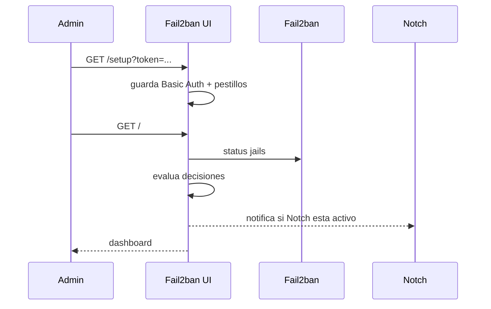

# Fail2ban UI

[](#)
[](#)
[](#)
[](#api-y-swagger)
[](https://jeturing.com)

Panel web seguro para operar y observar Fail2ban con setup inicial, Basic Auth, API local, Swagger sin CDN, notificaciones Notch y motor de decisiones configurable.

**Validado:** 2026-05-27 · **Entorno objetivo:** Debian/Ubuntu con systemd, Fail2ban y acceso por Tailscale/VPN/local.

---

## Tabla de contenido

1. [Novedades](#novedades)
2. [Stack tecnologico](#stack-tecnologico)
3. [Arquitectura](#arquitectura)
4. [Instalacion rapida](#instalacion-rapida)
5. [Setup inicial](#setup-inicial)
6. [Seguridad](#seguridad)
7. [Notch y decisiones](#notch-y-decisiones)
8. [API y Swagger](#api-y-swagger)
9. [Variables](#variables)
10. [Servicios instalados](#servicios-instalados)
11. [Testing](#testing)
12. [Changelog](#changelog)

---

## Novedades

- **Setup inicial web**: configura usuario, clave, jails, whitelist protegida, API, Swagger, Notch y decisiones.
- **Seguro por defecto**: Basic Auth obligatorio, sin CDN, sin mapas externos y sin enriquecimiento externo salvo activacion.
- **Notch**: webhook configurable para alertas automaticas con payload enmascarado por defecto.
- **Motor de decisiones**: modo `notify`, `recommend` o `auto`; el modo automatico requiere tambien `write_actions`.
- **Un comando**: `scripts/install.sh` instala Fail2ban si falta, configura jails base, servicio systemd y timer.

---

## Stack tecnologico

| Capa | Tecnologia |
| --- | --- |
| Backend | Flask + Python 3 |
| Seguridad | Basic Auth + PBKDF2-SHA256 + headers CSP/no-store |
| Servicio | systemd service |
| Automatizacion | systemd timer cada 5 minutos |
| Firewall/ban | Fail2ban + ipset |
| API | OpenAPI JSON + docs locales sin CDN |

---

## Arquitectura

```mermaid
flowchart TD
  Admin[Admin via Tailscale/VPN/Local] --> UI[Fail2ban UI Flask]
  UI --> F2B[fail2ban-client]
  UI --> Journal[journalctl]
  UI --> SS[ss/iproute2]
  UI --> Config[/etc/fail2ban-ui/config.json]
  Timer[systemd timer] --> Tick[decision tick]
  Tick --> UI
  UI -->|opcional| Notch[Notch webhook]
```



---

## Instalacion rapida

```bash
git clone https://github.com/jeturing/fail2ban-ui.git
cd fail2ban-ui
sudo bash scripts/install.sh
```

Al final el instalador imprime una URL como:

```text
http://127.0.0.1:2020/setup?token=<TOKEN>
```

Abrela por localhost, SSH tunnel, Tailscale o VPN. No publiques este panel directo a Internet.

---

## Setup inicial

1. Crea el usuario y una clave de al menos 12 caracteres.
2. Define nombre del panel, servidor, bind host y puerto.
3. Configura los jails que existen o quieres crear: `sshd,portscan,sensible-ports,recidive-48h,blacklist-permanent`.
4. Activa los pestillos deseados:
   - leer journal;
   - inventario de puertos;
   - acciones de escritura;
   - API;
   - Swagger local;
   - enriquecimiento externo;
   - enlaces externos;
   - enmascarar IPs.
5. Configura Notch si quieres alertas.
6. Configura el motor de decisiones: solo notificar, recomendar o automatico.

Cambios de `bind_host` o `bind_port` requieren reiniciar:

```bash
sudo systemctl restart fail2ban-ui
```

---

## Seguridad

| Control | Estado por defecto |
| --- | --- |
| Basic Auth | Obligatorio tras setup |
| Password storage | PBKDF2-SHA256 con salt |
| CDN/mapas externos | Apagado/no usado |
| GeoIP/Shodan | Apagado |
| Acciones de escritura | Apagado |
| Swagger | Activable, protegido por Basic Auth |
| Setup sin token | Solo IP local/privada/Tailscale |
| Setup con token | `FAIL2BAN_UI_SETUP_TOKEN` |

El archivo de configuracion se guarda con permisos `0600`.

---

## Notch y decisiones

Notch se configura en el setup inicial o en Ajustes:

| Campo | Uso |
| --- | --- |
| Webhook URL | Destino HTTP POST |
| Token Bearer | Encabezado `Authorization: Bearer ...` |
| Payload | `masked` o `full` |
| Severidad minima | `info`, `warning`, `critical` |

El motor de decisiones soporta:

| Modo | Comportamiento |
| --- | --- |
| `notify` | Solo crea decision/notificacion |
| `recommend` | Recomienda ban cuando supera el umbral |
| `auto` | Ejecuta `banip` solo si `write_actions` esta activo |

El modo automatico evita IPs privadas, loopback, multicast, reservadas y redes protegidas.

---

## API y Swagger

Endpoints principales:

| Ruta | Metodo | Descripcion |
| --- | ---: | --- |
| `/health` | GET | Salud del servicio |
| `/api/stats` | GET | Estado del dashboard |
| `/api/unban/<ip>` | POST | Desbanear IP si escritura esta activa |
| `/api/whitelist` | GET | Lista whitelist |
| `/api/whitelist/add` | POST | Agregar whitelist |
| `/api/whitelist/remove` | POST | Eliminar whitelist |
| `/api/openapi.json` | GET | Especificacion OpenAPI |
| `/api/docs` | GET | Swagger local sin CDN |

---

## Variables

| Variable | Default | Descripcion |
| --- | --- | --- |
| `FAIL2BAN_UI_CONFIG_PATH` | `/etc/fail2ban-ui/config.json` | Config persistente |
| `FAIL2BAN_UI_STATE_PATH` | `/var/lib/fail2ban-ui/state.json` | Memoria de decisiones/notificaciones |
| `FAIL2BAN_UI_SETUP_TOKEN` | generado por instalador | Token de setup |
| `FAIL2BAN_UI_BIND_HOST` | `127.0.0.1` | Host inicial |
| `FAIL2BAN_UI_BIND_PORT` | `2020` | Puerto inicial |
| `FAIL2BAN_UI_AUTH_USERNAME` | `admin` | Usuario inicial opcional |
| `FAIL2BAN_UI_AUTH_PASSWORD` | vacio | Clave inicial opcional |

---

## Servicios instalados

```bash
sudo systemctl status fail2ban-ui
sudo systemctl status fail2ban-ui-tick.timer
sudo journalctl -u fail2ban-ui -f
```

El timer ejecuta el motor de decisiones cada 5 minutos:

```bash
sudo systemctl start fail2ban-ui-tick.service
```

---

## Testing

```bash
python3 -m py_compile app.py scripts/fail2ban_ui_tick.py
bash -n scripts/install.sh
```

---

## Changelog

| Version | Fecha | Cambios |
| --- | --- | --- |
| 1.0.0 | 2026-05-27 | Setup inicial, Basic Auth, Notch, decisiones, API, instalador systemd |

---

Copyright Jeturing. Revisar licencia final antes de publicar el repositorio.
